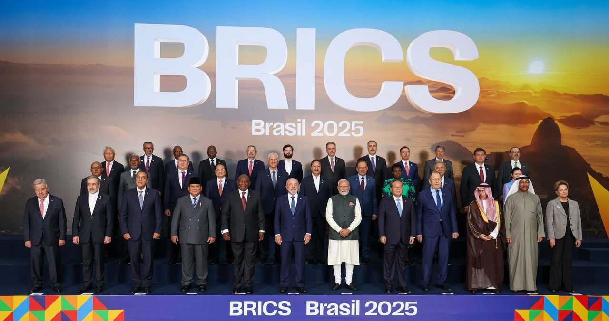

The origin of BRICS is traced back to the Goldman Sachs paper titled *Building Better
Global Economic BRICs* by Jim O'Neill, which argued that the four nations, that is Brazil,
Russia, India and China, were growing and expected to grow faster than the G7 countries.
First, the paper was right: BRICS did grow at an outstanding pace in the last two and a
half decades. Second, the paper argued facts about the world economy and the impact of
these four countries on it. The paper highlighted how the BRICS nations could contribute
to the world economy and provide deterrence against economic disturbances.

*Heads of delegation at the 17th BRICS summit, Rio de Janeiro, July 2025. Photograph by the
[Prime Minister's Office, Government of India](https://commons.wikimedia.org/wiki/File:2025_BRICS_Summit_Family_Picture.jpg),
used under the [Government Open Data License – India](https://data.gov.in/government-open-data-license-india).
Resized for the web.*

But enough about the history. Today, the evolution of BRICS is significant, though it has
seen times when BRICS was thought to be dead because of differences among partner nations,
specifically India and China. However, BRICS, with its joint effort, has overcome these
obstacles, established economic dialogues among partner nations on their regional terms,
and also established financial institutions like the New Development Bank to provide
financial support with little to no strings attached to its partner members.

The significance of BRICS has also become very apparent in light of recent geopolitical
events: the Hormuz crisis, the Russia–Ukraine war, the US presidency, COVID-19. Each of
these events has fractured the old economic arrangements and shown that the risks of
dependency on the US and the West-led institutions could lead to the undermining of the
sovereignty of nations.

BRICS has reached a maturity stage as well. Earlier, it struggled with what it wanted to
do; it sort of tried to copy the G7 club but realised soon that its ambitions are
different. At one point, it also tried to create an alternative to the West-led financial
system. However, it realised the current international financial system is too complex and
too dependent on the West and hence cannot be moved away from immediately. Therefore, the
terminology for de-dollarisation has changed: rather than replacing the dollar, it is
encouraging exchanges in regional currencies to the extent possible and utilising the
dollar system in the rest of the exchanges.

Further, BRICS provides a platform to discuss and to partner up on critical issues such as
energy supplies, climate financing and even less concerning geopolitical differences. It
helps warm up ties between nations and show solidarity with friendly nations. It also
helps in showcasing a nation's soft power.

Currently, in my opinion, India is trying to leverage and grow its soft power through the
chairmanship of the BRICS summit, and earlier the G20. India has realised the power of
perception that such international events can create. It can then leverage this in its
economic and political ties worldwide. India is highly dependent on many nations — the US,
China, Russia, the Middle East and others — for the prosperity of its economy. This is not
to say that there is no other direction of dependence; the same countries are also highly
dependent on India for their economic prosperity. That is why summits like BRICS and the
G20 help in making dialogues around conversations and making deals and agreements which
help India and the partnering nations.

Therefore, keep a watch on who visited India, the theme, and the events lined up around
the 18th BRICS summit being held in New Delhi between 12 and 13 September 2026.
